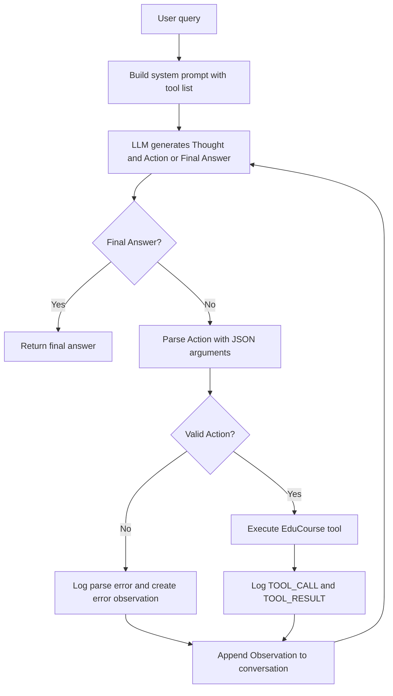

# Group Report: Lab 3 - Production-Grade Agentic System

- **Team Name**: Group 066 - EduCourse ReAct Agent
- **Team Members**: Nhi, Huy, Nghĩa
- **Project Topic**: Course Registration Advisor: A ReAct Agent for Educational Course Enrollment
- **Repository**: https://github.com/lemin9802/lab3-066-educourse-react-agent
- **Deployment Date**: 2026-06-01
- **Final Evaluation Run**: `evaluation/results/all_openai_20260601_161854.json`
- **Aggregate Analysis**: `evaluation/results/analysis_summary.md`

---

## 1. Executive Summary

Our team built **EduCourse ReAct Agent**, a course registration assistant that compares a baseline chatbot with a ReAct Agent. The baseline chatbot calls the LLM directly, while the ReAct Agent can use tools to search for courses, check remaining seats, validate coupon codes, and calculate final tuition.

The main task is to support multi-step student queries such as:

```text
Em muốn học Python beginner vào buổi tối, ngân sách khoảng 1.500.000 VND.
Còn lớp nào phù hợp không và học phí sau mã STUDENT10 là bao nhiêu?
```

For this query, ReAct Agent v1 can execute the following tool sequence:

```text
search_courses -> check_class_slots -> get_coupon -> calculate_tuition -> Final Answer
```

- **Final-run success rate**: Agent v1 passed **5/6 cases (83.33%)**; the chatbot baseline passed **0/6 cases (0.00%)**.
- **Aggregate success rate across saved runs**: Agent v1 passed **25/42 cases (59.52%)**; the chatbot baseline passed **2/36 cases (5.56%)**.
- **Key Outcome**: The ReAct Agent performed better on multi-step queries because its answers were grounded in tool results instead of relying only on LLM guesses.
- **Main Limitation**: Some semantically correct answers may still fail the evaluator because the evaluator uses fixed keyword or phrase matching.

The required team scope is **Agent v1**. Agent v2 and deeper improvements are treated as optional extensions or future work.

---

## 2. System Architecture & Tooling

### 2.1 ReAct Loop Implementation

The agent is implemented in `src/agent/agent.py` using the `ReActAgent` class. The main loop follows the **Thought-Action-Observation** pattern and is limited by `max_steps=5` to prevent infinite loops.



Successful main-case flow:

```text
Thought: Search for Python beginner evening courses.
Action: search_courses({"topic": "Python", "level": "beginner", "schedule": "evening"})
Observation: PY101 found, tuition 1,500,000 VND, slots_left = 5

Thought: Check whether PY101 still has available slots.
Action: check_class_slots({"course_id": "PY101"})
Observation: available = true, slots_left = 5

Thought: Validate the STUDENT10 coupon.
Action: get_coupon({"coupon_code": "STUDENT10"})
Observation: valid = true, discount_percent = 10

Thought: Calculate final tuition.
Action: calculate_tuition({"course_id": "PY101", "coupon_code": "STUDENT10"})
Observation: final_tuition_vnd = 1,350,000

Final Answer: The Python Beginner class is available, and the tuition after applying STUDENT10 is 1,350,000 VND.
```

Main guardrails:

- The agent can only use declared tools.
- The agent must not invent tool names or observations.
- Each step can call only one action.
- Action arguments must be valid JSON.
- The agent must check class slots before recommending a course as available.
- If a coupon is invalid, the agent must clearly state that the coupon is invalid and must not apply a discount.
- The final answer should be in Vietnamese when the user asks in Vietnamese.

### 2.2 Tool Definitions (Inventory)

| Tool Name | Input Format | Use Case |
| :--- | :--- | :--- |
| `search_courses` | JSON object with `topic`, `level`, optional `schedule` | Search for courses in the EduCourse catalog. |
| `check_class_slots` | JSON object with `course_id` | Check whether a course still has available seats. |
| `get_coupon` | JSON object with `coupon_code` | Validate a discount coupon. |
| `calculate_tuition` | JSON object with `course_id`, `coupon_code` | Calculate final tuition after discount in VND. |

The tools are narrow and deterministic, which makes the agent's answers traceable to actual data in the code.

### 2.3 Fake Course Catalog

| Course ID | Course Name | Topic | Level | Schedule | Tuition | Slots Left |
| :--- | :--- | :--- | :--- | :--- | ---: | ---: |
| `PY101` | Python Beginner | Python | beginner | evening | 1,500,000 VND | 5 |
| `PY201` | Python Data Analysis | Python | intermediate | weekend | 2,200,000 VND | 2 |
| `WEB101` | Web Development Beginner | Web | beginner | evening | 1,200,000 VND | 0 |
| `DS101` | Data Science Foundation | Data Science | beginner | weekend | 2,500,000 VND | 3 |
| `AI101` | AI for Beginners | AI | beginner | evening | 1,800,000 VND | 4 |

Coupon catalog:

| Coupon Code | Discount |
| :--- | ---: |
| `STUDENT10` | 10% |
| `EARLYBIRD` | 15% |
| `WELCOME5` | 5% |
| `NONE` | 0% |

### 2.4 LLM Providers Used

- **Primary**: OpenAI `gpt-4o-mini`
- **Secondary (Backup)**: Gemini `gemini-2.5-flash`
- **Provider Switching**: `evaluation/run_evaluation.py` supports `--provider openai`, `--provider gemini`, and `--provider google`.

The agent can also be run directly with:

```bash
python run_agent.py --provider openai
python run_agent.py --provider gemini
```

This shows that the ReAct loop is separated from provider-specific implementation.

---

## 3. Telemetry & Performance Dashboard

The system writes structured logs to the `logs/` directory and exports evaluation results to `evaluation/results/`.

### 3.1 Aggregate Metrics

| Metric | Value |
| :--- | ---: |
| Total runs | 78 |
| Completed runs | 78 |
| Passed runs | 27 |
| Overall success rate | 34.62% |
| Average latency | 4195.19 ms |
| Average total tokens | 707.94 |
| Average loop count | 1.48 |
| Parser errors | 0 |
| Unknown tool errors | 0 |
| Timeouts | 0 |
| Tool errors | 0 |

### 3.2 By Target

| Target | Runs | Success Rate | Avg Latency | Avg Tokens | Avg Loops |
| :--- | ---: | ---: | ---: | ---: | ---: |
| `agent_v1` | 42 | 59.52% | 5585.48 ms | 2403.5 | 3.27 |
| `chatbot` | 36 | 5.56% | 2573.19 ms | 142.75 | N/A |

### 3.3 Final Run Snapshot

| Target | Passed | Failed | Success Rate | Max Latency | Notes |
| :--- | ---: | ---: | ---: | ---: | :--- |
| `chatbot` | 0 | 6 | 0.00% | 3679 ms | Often gives general answers and cannot access the catalog. |
| `agent_v1` | 5 | 1 | 83.33% | 14497 ms | Performs well on tool-based tasks; failed one case due to wording/evaluator mismatch. |

The agent is slower than the chatbot and uses more tokens because it performs multiple reasoning steps and tool calls. However, the agent is significantly more accurate for queries that require course data, coupon validation, and tuition calculation.

### 3.4 Telemetry Events

| Event | Count |
| :--- | ---: |
| `AGENT_START` | 12 |
| `AGENT_STEP_START` | 21 |
| `AGENT_LLM_OUTPUT` | 21 |
| `TOOL_CALL` | 15 |
| `TOOL_RESULT` | 15 |
| `AGENT_FINAL_ANSWER` | 6 |
| `AGENT_END` | 12 |
| `CHATBOT_BASELINE_START` | 18 |
| `CHATBOT_BASELINE_END` | 18 |
| `LLM_METRIC` | 21 |

The current system tracks tokens and latency. Cost is not computed directly yet, but it can be added by multiplying prompt and completion tokens by each model's pricing.

---

## 4. Root Cause Analysis (RCA) - Failure Traces

### Case Study: Budget Comparison Wording Mismatch

- **Case**: `course_003`
- **Input**: The student wants to study Data Science beginner on the weekend with a budget of 2,000,000 VND.
- **Expected**: Find `DS101`, report tuition of 2,500,000 VND, compare it with the budget, and conclude that the course exceeds the budget.
- **Agent Answer**: The agent found the correct course, Data Science Foundation, reported tuition of 2,500,000 VND, and said the tuition was "above your budget of 2,000,000 VND".
- **Evaluation Result**: Failed the `mentions_over_budget` check.
- **Root Cause**: The evaluator used limited keyword matching. The phrase "above your budget" is semantically correct, but it was not included in the checked phrase list, such as `exceeds` or Vietnamese equivalents.
- **Impact**: This was an evaluator-output mismatch, not a tool execution failure.
- **Recommended Fix**: Expand `evaluate_answer` with equivalent phrases such as "above your budget", "over budget", "vượt ngân sách"; also require the agent to answer consistently in Vietnamese when the user asks in Vietnamese.

### Baseline Failure Pattern

The chatbot baseline failed all 6 cases in the final run. Main failure patterns:

- It could not access the catalog and often advised the user to check a website or contact the center.
- It could not calculate final tuition after `STUDENT10` or `EARLYBIRD`.
- It did not clearly confirm that `FAKECODE` was invalid.
- It could not reliably detect that `WEB101` was already full.

This shows that for tasks requiring state and calculation, a pure LLM chatbot is less reliable than an agent with tools.

---

## 5. Ablation Studies & Experiments

### Experiment 1: Chatbot Baseline vs ReAct Agent

| Case | Chatbot Result | Agent Result | Winner |
| :--- | :--- | :--- | :--- |
| `simple_001` | Fail: general answer | Pass: lists catalog | Agent |
| `course_001` | Fail: does not calculate final tuition | Pass: 1,350,000 VND | Agent |
| `course_002` | Fail: does not confirm full class | Pass: WEB101 is full | Agent |
| `course_003` | Fail: does not compare against real tuition | Failed due to wording, but retrieved correct data | Agent with caveat |
| `course_004` | Fail: does not calculate final tuition | Pass: 1,530,000 VND | Agent |
| `failure_001` | Fail: does not clearly reject coupon | Pass: rejects `FAKECODE` | Agent |

### Experiment 2: Prompt Guardrails

The agent prompt was strengthened with strict tool-use rules:

- Use only tools in the provided tool list.
- Do not invent observations.
- Action arguments must be valid JSON.
- Check slots before recommending a class as available.
- If a coupon is invalid, do not apply a discount.
- Answer in Vietnamese when the user asks in Vietnamese.

Aggregate result:

- Parser errors: 0
- Unknown tool errors: 0
- Tool errors: 0
- Timeouts: 0

This shows that the contract among the prompt, parser, and tool registry worked reliably during evaluation.

### Experiment 3: OpenAI vs Gemini Provider Switching

| Provider | Model | Result |
| :--- | :--- | :--- |
| OpenAI | gpt-4o-mini | Successfully completed multi-step tuition calculation |
| Gemini | gemini-2.5-flash | Successfully handled the full-class edge case |

Both providers worked through the same ReAct Agent interface. This confirms that the agent implementation is not tightly coupled to a single LLM provider.

---

## 6. Production Readiness Review

### Security

- API keys are stored in `.env`.
- `.env` is not committed to GitHub.
- The public repository only includes `.env.example`.
- The agent only calls tools from a fixed registry and does not execute arbitrary user-provided functions.

Future production improvements:

```text
- Use a managed secret store instead of local .env files.
- Validate all tool arguments with schemas before execution.
- Add authentication if real student data is used.
```

### Guardrails

Current guardrails:

```text
- max_steps=5 prevents infinite ReAct loops.
- Tool names are restricted to the provided tool list.
- Tool execution errors return structured observations.
- Final answers are forced to Vietnamese for Vietnamese demos.
```

Future guardrails:

```text
- Add retry logic for invalid Action format.
- Add strict JSON schema validation for each tool.
- Add a supervisor layer to review tool calls before execution.
```

### Observability

- The system logs agent start/end, step start, LLM output, tool call/result, token usage, and latency.
- Evaluation results are saved in `evaluation/results/`.
- Aggregate analysis compares the chatbot baseline and the agent.

### Scaling

Current limitation:

```text
The system uses a small fake course catalog stored in Python dictionaries.
```

Future scaling plan:

```text
- Replace fake dictionary data with a database.
- Add tools for enrollment, prerequisites, schedule conflicts, and payment.
- Cache common course search results.
- Move from a simple loop to a graph-based workflow such as LangGraph for complex branching.
```

### Reliability

Current limitation:

```text
Agent v1 relies on regex-based Action parsing, so it is sensitive to model output format.
The evaluator also relies on keyword matching, so semantically correct answers may fail some checks.
```

Future reliability improvements:

```text
- Use structured tool calling instead of regex parsing.
- Add automatic fallback when parsing fails.
- Normalize Vietnamese text in the evaluator.
- Expand semantic matching for evaluation.
- Record pass/fail results for each evaluation case.
```

---

## 7. Submission Notes

The official group report file for Group 066 is:

```text
report/group_report/GROUP_REPORT_066.md
```

Public repository:

```text
https://github.com/lemin9802/lab3-066-educourse-react-agent
```
